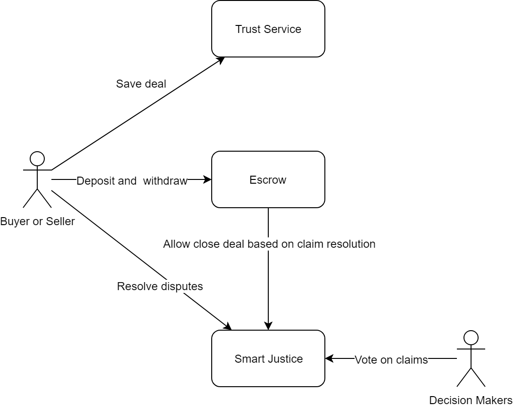

# Digital Deal Contracts

## About
Digital Deal is a system of integrated Ethereum smart contract services that provides secured decentralized payment platform with dispute resolution based on arbitration.

Digital deal consists of the following projects:

* [Trust Service](https://github.com/BANKEX/digital-deal-contracts/wiki/Trust-Service)
* [Escrow](https://github.com/BANKEX/digital-deal-contracts/wiki/Escrow)
* [Smart Justice](https://github.com/BANKEX/digital-deal-contracts/wiki/Smart-Justice)

## How does it work?

* Buyer or seller (service provider) save deal in the blockchain using Trust Service.
* Buyer deposit payment and if all deal conditions are satisfied, buyer release payment and seller withdraw money.
* In case of dispute, buyer or seller can submit a claim to Smart Justice to resolve the deal.
