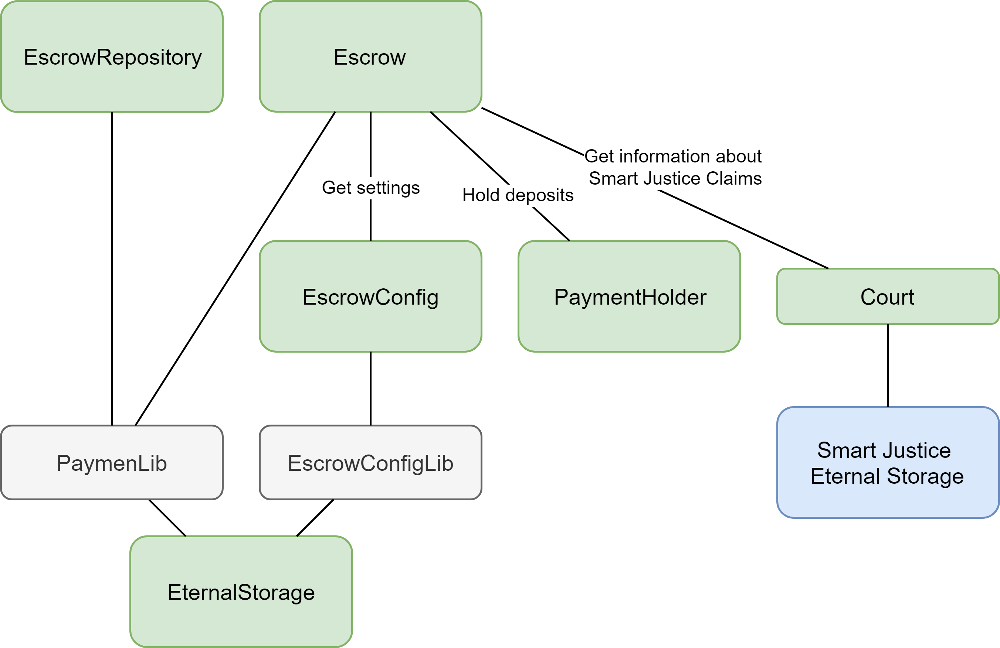

# Digital Deal Contracts

## About
Digital Deal is a system of integrated Ethereum smart contract services that provides secured decentralized payment platform with dispute resolution based on arbitration.

Digital deal consists of the following projects:

* [Trust Service Contracts](#trust-service-contracts)
* [Escrow Contracts](#escrow-contracts)
* [Smart Justice Contracts](#smart-justice-contracts)

## How does it work?


* Buyer or seller (service provider) save deal in the blockchain using Trust Service.
* Buyer deposit payment and if all deal conditions are satisfied, buyer release payment and seller withdraw money.
* In case of dispute, buyer or seller can submit a claim to Smart Justice to resolve the deal.

## Trust Service Contracts

### About
This is a developer guide explaining how to work with Trust Service and describes all its states, roles and models.

### What is Trust Service?
Trust Service is a secure decentralized "handshake" for deals and agreements. 

### How does it work?
Main use case:


1. One deal party secures it using Trust Service.
2. Other deal parties sign it confirmed their participation.


#### Deal
Deal is the main contract model defined as:
* dealHash - hash that is defined on the client side and can be computed from the different number of deal values: title, description, file hashes and so on.
* addresses - participants addresses. 
* dealId - number of deal.

### Contracts Architecture


Contracts:
* TrustService - main contract where logic are placed.
* TrustServiceStorage - storage contract to save and update deals.

## Escrow Contracts

### About
This is a developer guide explaining how to work with Escrow and describes all its states, roles and models.

### What is Escrow?
Escrow is a secured way to deposit of deal amount from a buyer and transfer it to a seller after deal completion is handled through the smart contract.

### Glossary
There are several terms are used in smart contracts:
* Payment - main model for all operations.
* Depositor - good/service buyer, person who deposit money.
* Beneficiary - good/service seller, person who receives money.
* Amount – value in ETH or any ERC-20 token.

### How does it work?
Main use case:
1. Depositor creates payment.
2. Depositor deposits payment amount and beneficiary accepts payment.
3. Depositor releases payment.
4. Beneficiary confirms withdraw.

#### Payment
Central operation model is payment defined as keccak256 hash of:
* depositor address
* beneficiary address
* token address (0x0 in case of ETH amount)
* deal hash - bytes32 hash of all. See more in [Trust Service Integration ](#trust-service-integration).
* amount - uint256 value of payment

#### Payment States
All operations are based on payment state machine.


Payment states:
* CREATED - depositor created payment, but didn't deposit deal amount yet. 
* CONFIRMED - depositor deposited full payment amount and beneficiary signed payment. Both actions are required to reach this state.
* CANCELED - if depositor or beneficiary canceled payment. If depositor had deposited amount before, it has been refunded.
* RELEASED - depositor released payment amount to beneficiary. Also, this state can be reached by accepting [offer](#offering) by one of the payment party.
* CLOSED - this state can be reached in the following cases:
    * Beneficiary withdrew full amount after depositor released payment.
    * Depositor or beneficiary accepted another participant offer and both withdrew their parts.
    * Depositor or beneficiary submitted claim to Smart Justice and then withdrew according case verdict. See more in [Smart Justice Integration](#smart-justice-integration).

#### Offering

Offer is an amount proposal from one payment party to another to close payment. The main purpose of this use case is to resolve situations when not all deal conditions were satisfied and there is need partial release to beneficiary and refund to depositor.
Offer defines amount to pay to offer sender, and the rest (amount-offer) to another party.

#### Contract method invocation 

Escrow contract methods are used to change state of particular payment if it exists and is valid. All such methods have the common structure of parameters:
* address[3] addresses: {depositor, beneficiary, token}
* bytes32 deal
* uint256 amount
* ...other

The first three parameters are used to define payment. As these values are not changed after payment creation they can be kept on the client side to optimize gas usage.

### Contracts architecture

Contracts:
* Escrow - main smart contract, where logic are placed.
* EscrowRepository provides convenient reading of payment state.
* EscrowConfig - contract for setting configuration.
* PaymentHolder - contract to hold deposited values in ETH and ERC-20. Moving implementation of keeping values from operation logic is made by migration and security reasons.
* EternalStorage - base contract for keeping state. [Read this article for more information](https://medium.com/rocket-pool/upgradable-solidity-contract-design-54789205276d).
* PaymentLib - payment state read/write adapter for EternalStorage.
* EscrowConfigLib - configuration settings read/write adapter for EternalStorage.
* Court. See more in [Smart Justice Integration](#smart-justice-integration).


### Integrations

#### Trust Service Integration 
There are a lot of ways to create payment deal hash, but preferred way is to use BANKEX Trust Service. Integration is done on client side: user must save deal details in Trust Service and after that create new payment in Escrow.

#### Smart Justice Integration
Smart Justice integration is aimed to resolve claims between depositor and beneficiary during the deal. It based on resolving payment according case verdict following the rules:
* If claim was won, applicant can withdraw claimed amount, respondent can withdraw all the rest (if claimed amount wasn't the full amount of payment).
* If claim was lost, respondent can withdraw full payment amount.

Escrow can read information directly from Smart Justice Eternal Storage though *Court* Smart Contract.

## Smart Justice Contracts

### About
This is a developer guide explaining how to work with Smart Justice and describes all its states, roles and models.

### What is Smart Justice?
Smart Justice is a decentralized dispute resolution service. It consists of a procedure for initiating proceedings in dispute resolution and an incentivised system for becoming a Decision Maker to cast votes and validate claims in the dispute resolution process.

Smart Justice contract does guarantee, however, proof of terms of an agreement. In the event of a dispute over a transaction, the smart contract is an expert witness that can be leveraged to determine if one part or another has actually fulfilled the terms of the contract.


### Glossary
There are several terms are used in smart contracts:
* Case - dispute that can be submitted by applicant to respondent.
* Applicant - case initiator.
* Respondent - another party of case.
* Case amount – value in ETH or BKX token, this value is claimed by applicant.
* Case Referee Award - value in ETH or BKX token to pay to referees.
* Referee - person who has votes and can make decision on particular case, decision maker.

### How does it work?

#### Main flow
Main application flow:
1. Applicant opens case, smart contract assigns random referees to it.
2. Respondent submits response to the case.
3. Referees vote for applicant or for respondent depending on their own choice.
4. Smart contract counts votes for applicant and for respondent and make decision who wins based on the bigger value.

#### Case
The central model is case defined as keccak256 hash of:
* applicant address
* respondent address
* deal hash in bytes32
* creation timestamp
* title in bytes32
* case amount

***
All operations are based on case state machine.


##### Case states:
* OPENED - applicant opened case.
* VOTING - time to voting is passed or respondent submitted response to the case.
* REVEALING - voting time is passed and all referees must reveal their votes before close time. See [voting](#voting).(https://karl.tech/learning-solidity-part-2-voting/).
* CLOSED - verdict was invoked. See [case resolution](#case_resolution).
* CANCELED - verdict was invoked, but amount of votes wasn't enough to make decision (threshold value is defined in configuration) or number of votes for applicant is equal as for respondent.

All methods to change case state can be invoked by anymore and are restricted only by the case current status and timing.

##### Case states timing:
Contract defined values:
* voting time = opening time + response period (time to voting)
* revealing time = voting time + voting period (time to revealing)
* close time = revealing time + revealing period (time to close)

All time periods are defined in the BoardConfig and can be changed by its owner (admin).

All times are saved for each case individually on opening, thus changing global setting doesn't change particular case timing.

##### Case resolution
Case resolution or verdict is defined as boolean _won_ value:
* true - applicant won
* false - respondent won

Smart contract counts revealed votes for applicant (=votesForApplicant ) and for respondent (=votesForRespondent) and makes decision:
```
if (votesForApplicant + votesForRespondent < minNumberOfVotes) {
    //exception - not enough votes - case is canceled
} else if (votesForApplicant == votesForRespondent) {
    //exception - equal number of votes - case is canceled
} else if (votesForApplicant > votesForRespondent) {
    won = true;
} else {
    won = false;
}
```

#### Voting
Voting process is based on [commit-reveal pattern](https://karl.tech/learning-solidity-part-2-voting/) to hide actual referee decision until the end of voting period.


Referee is an account who has _votes_. _Vote_ is a right to make decision on particular case and defined as simple number value in the contract. Any user can acquire votes for BKX tokens using method _applyForReferee_. 

Referee can be assigned by contract to any case and during voting time make a decision (_commitVote_). On the revealing phase referee must reveal his own vote (_revealVote_) to make it available for contract to count votes for both case sides.

### Contracts architecture

Contracts:
* Board - main smart contract, where logic are placed.
* BoardRepository provides convenient reading of case state.
* BoardConfig - contract for setting configuration.
* PaymentHolder - contract to hold deposited values in ETH and ERC-20. Moving implementation of keeping values from operation logic is made by migration and security reasons.
* EternalStorage - base contract for keeping state. [Read this article for more information](https://medium.com/rocket-pool/upgradable-solidity-contract-design-54789205276d).
* Libs - cases, referees, referee votes states read/write adapter for EternalStorage.
* BoardConfigLib - configuration settings read/write adapter for EternalStorage.