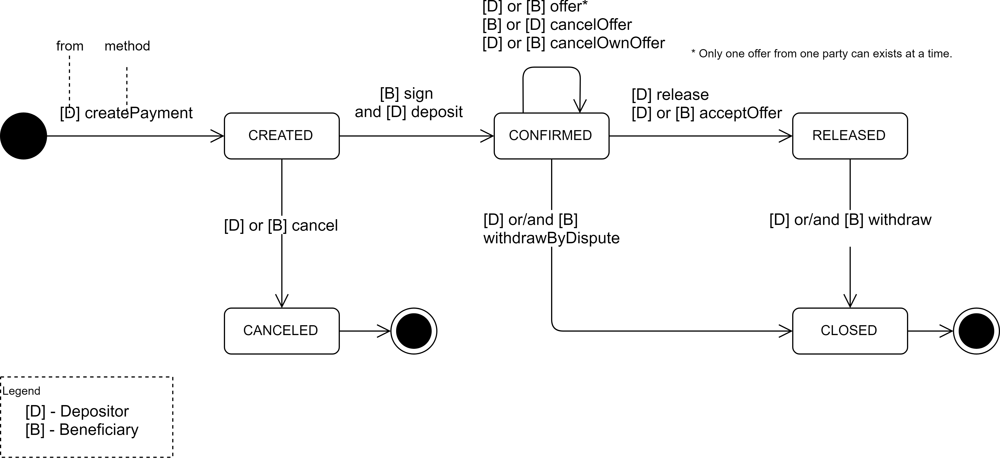
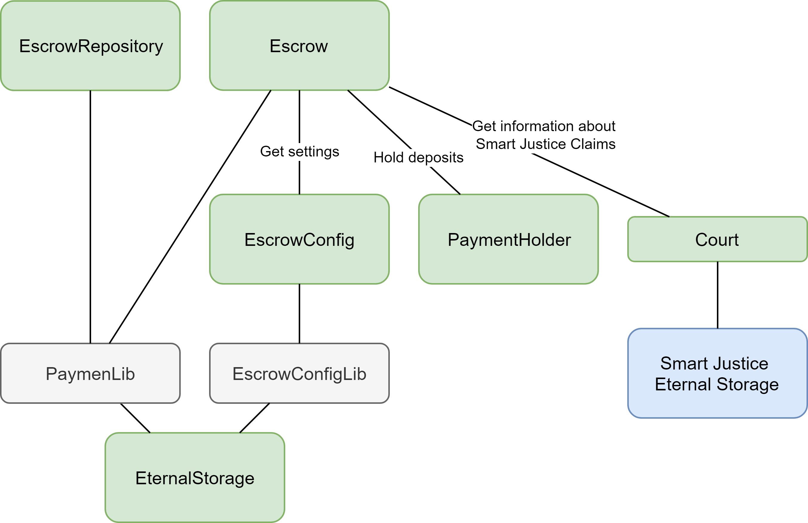

# Escrow Smart Contract

## About
This is a developer guide explaining how to work with Escrow and describes all its states, roles and models.

## What is Escrow?
Escrow is a secured way to deposit of deal amount from a buyer and transfer it to a seller after deal completion is handled through the smart contract.

## Glossary
There are several terms are used in smart contracts:
* Payment - main model for all operations.
* Depositor - good/service buyer, person who deposit money.
* Beneficiary - good/service seller, person who receives money.
* Amount – value in ETH or any ERC-20 token.

## How does it work?
Main use case:
1. Depositor creates payment.
2. Depositor deposits payment amount and beneficiary accepts payment.
3. Depositor releases payment.
4. Beneficiary confirms withdraw.

### Payment
Central operation model is payment defined as keccak256 hash of:
* depositor address
* beneficiary address
* token address (0x0 in case of ETH amount)
* deal hash - bytes32 hash of all. See more in [Trust Service Integration ](#trust-service-integration).
* amount - uint256 value of payment

### Payment States
All operations are based on payment state machine.

Payment states:
* CREATED - depositor created payment, but didn't deposit deal amount yet. 
* CONFIRMED - depositor deposited full payment amount and beneficiary signed payment. Both actions are required to reach this state.
* CANCELED - if depositor or beneficiary canceled payment. If depositor had deposited amount before, it has been refunded.
* RELEASED - depositor released payment amount to beneficiary. Also, this state can be reached by accepting [offer](#offering) by one of the payment party.
* CLOSED - this state can be reached in the following cases:
    * Beneficiary withdrew full amount after depositor released payment.
    * Depositor or beneficiary accepted another participant offer and both withdrew their parts.
    * Depositor or beneficiary submitted claim to Smart Justice and then withdrew according case verdict. See more in [Smart Justice Integration](#smart-justice-integration).

### Offering

Offer is an amount proposal from one payment party to another to close payment. The main purpose of this use case is to resolve situations when not all deal conditions were satisfied and there is need partial release to beneficiary and refund to depositor.
Offer defines amount to pay to offer sender, and the rest (amount-offer) to another party.

### Contract method invocation 

Escrow contract methods are used to change state of particular payment if it exists and is valid. All such methods have the common structure of parameters:
* address[3] addresses: {depositor, beneficiary, token}
* bytes32 deal
* uint256 amount
* ...other

The first three parameters are used to define payment. As these values are not changed after payment creation they can be kept on the client side to optimize gas usage.

## Contracts architecture

Contracts:
* Escrow - main smart contract, where logic are placed.
* EscrowRepository provides convenient reading of payment state.
* EscrowConfig - contract for setting configuration.
* PaymentHolder - contract to hold deposited values in ETH and ERC-20. Moving implementation of keeping values from operation logic is made by migration and security reasons.
* EternalStorage - base contract for keeping state. [Read this article for more information](https://medium.com/rocket-pool/upgradable-solidity-contract-design-54789205276d).
* PaymentLib - payment state read/write adapter for EternalStorage.
* EscrowConfigLib - configuration settings read/write adapter for EternalStorage.
* Court. See more in [Smart Justice Integration](#smart-justice-integration).

## Integrations

### Trust Service Integration 
There are a lot of ways to create payment deal hash, but preferred way is to use BANKEX Trust Service. Integration is done on client side: user must save deal details in Trust Service and after that create new payment in Escrow.

### Smart Justice Integration
Smart Justice integration is aimed to resolve claims between depositor and beneficiary during the deal. It based on resolving payment according case verdict following the rules:
* If claim was won, applicant can withdraw claimed amount, respondent can withdraw all the rest (if claimed amount wasn't the full amount of payment).
* If claim was lost, respondent can withdraw full payment amount.

Escrow can read information directly from Smart Justice Eternal Storage though *Court* Smart Contract.