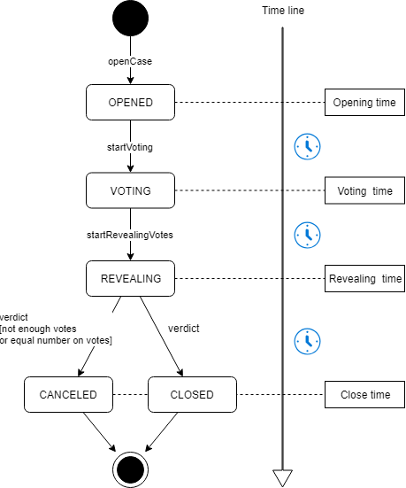
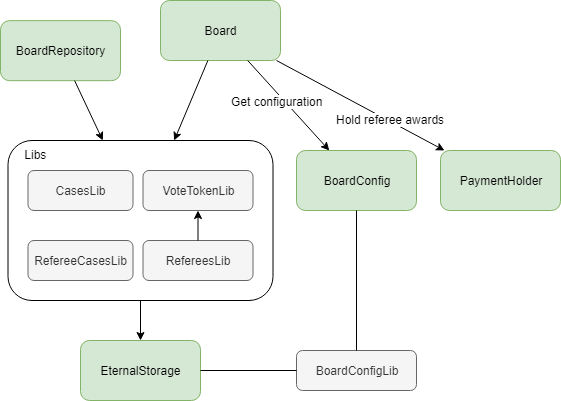

# Smart Justice Contracts

## About
This is a developer guide explaining how to work with Smart Justice and describes all its states, roles and models.

## What is Smart Justice?
Smart Justice is a decentralized dispute resolution service. It consists of a procedure for initiating proceedings in dispute resolution and an incentivised system for becoming a Decision Maker to cast votes and validate claims in the dispute resolution process.

Smart Justice contract does guarantee, however, proof of terms of an agreement. In the event of a dispute over a transaction, the smart contract is an expert witness that can be leveraged to determine if one part or another has actually fulfilled the terms of the contract.


## Glossary
There are several terms are used in smart contracts:
* Case - dispute that can be submitted by applicant to respondent.
* Applicant - case initiator.
* Respondent - another party of case.
* Case amount – value in ETH or BKX token, this value is claimed by applicant.
* Case Referee Award - value in ETH or BKX token to pay to referees.
* Referee - person who has votes and can make decision on particular case, decision maker.

## How does it work?

### Main flow
Main application flow:
1. Applicant opens case, smart contract assigns random referees to it.
2. Respondent submits response to the case.
3. Referees vote for applicant or for respondent depending on their own choice.
4. Smart contract counts votes for applicant and for respondent and make decision who wins based on the bigger value.

### Case
The central model is case defined as keccak256 hash of:
* applicant address
* respondent address
* deal hash in bytes32
* creation timestamp
* title in bytes32
* case amount

***
All operations are based on case state machine.



#### Case states:
* OPENED - applicant opened case.
* VOTING - time to voting is passed or respondent submitted response to the case.
* REVEALING - voting time is passed and all referees must reveal their votes before close time. See [voting](#voting).(https://karl.tech/learning-solidity-part-2-voting/).
* CLOSED - verdict was invoked. See [case resolution](#case_resolution).
* CANCELED - verdict was invoked, but amount of votes wasn't enough to make decision (threshold value is defined in configuration) or number of votes for applicant is equal as for respondent.

All methods to change case state can be invoked by anymore and are restricted only by the case current status and timing.

#### Case states timing:
Contract defined values:
* voting time = opening time + response period (time to voting)
* revealing time = voting time + voting period (time to revealing)
* close time = revealing time + revealing period (time to close)

All time periods are defined in the BoardConfig and contract can be changed by its owner (admin).

All times are saved for each case individually on opening, thus changing global setting doesn't change particular case timing.

#### Case resolution
Case resolution or verdict is defined as boolean _won_ value. 
Smart contract counts revealed votes for applicant (=votesForApplicant ) and for respondent (=votesForRespondent) and makes decision:
```
if (votesForApplicant + votesForRespondent < minNumberOfVotes) {
    //exception - not enough votes - case is canceled
} else if (votesForApplicant == votesForRespondent) {
    //exception - equal number of votes - case is canceled
} else if (votesForApplicant > votesForRespondent) {
    won = true;
} else {
    won = false;
}
```

### Voting
Voting process is based on [commit-reveal pattern](https://karl.tech/learning-solidity-part-2-voting/) to hide actual referee decision due to the end of voting period.


Referee is an account who has _votes_. _Vote_ is a right to make decision on particular case and defined as simple number value in the contract. Any user can acquire votes for BKX tokens using method _applyForReferee_. 

Referee can be assigned by contract to any case and during voting time make a decision (_commitVote_). On the revealing phase referee must reveal his own vote (_revealVote_) to make it available for contract to count votes for both case sides.


## Contracts architecture

Contracts:
* Board - main smart contract, where logic are placed.
* BoardRepository provides convenient reading of case state.
* BoardConfig - contract for setting configuration.
* PaymentHolder - contract to hold deposited values in ETH and ERC-20. Moving implementation of keeping values from operation logic is made by migration and security reasons.
* EternalStorage - base contract for keeping state. [Read this article for more information](https://medium.com/rocket-pool/upgradable-solidity-contract-design-54789205276d).
* Libs - cases, referees, referee votes states read/write adapter for EternalStorage.
* BoardConfigLib - configuration settings read/write adapter for EternalStorage.


