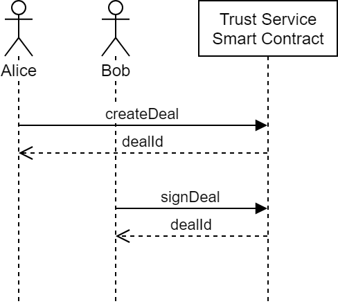
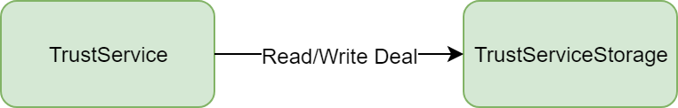

# Trust Service Contracts

## About
This is a developer guide explaining how to work with Trust Service and describes all its states, roles and models.

## What is Trust Service?
Trust Service is a secure decentralized "handshake" for deals and agreements. 

## How does it work?
Main use case:

1. One deal party secures it using Trust Service.
2. Other deal parties sign it confirmed their participation.

### Deal
Deal is the main contract model defined as:
* dealHash - hash that is defined on the client side and can be computed from the different number of deal values: title, description, file hashes and so on.
* addresses - participants addresses. 
* dealId - number of deal.

## Contracts Architecture

Contracts:
* TrustService - main contract where logic are placed.
* TrustServiceStorage - storage contract to save and update deals.